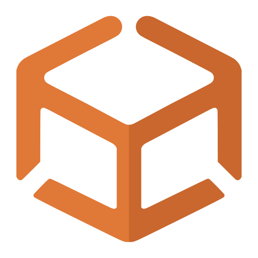

#  CrateX.app

## 🔗 Navegação rápida

- [Use todas as ferramentas online](https://cratex.app/pt)
- [Saiba mais sobre CrateX.app](https://cratex.app/pt/about)
- [Ver preços](https://cratex.app/pt/pricing)
- [Política de privacidade](https://cratex.app/privacy)
- [Política de cookies](https://cratex.app/cookie-policy)
- [Termos de uso](https://cratex.app/terms)

As páginas em inglês usam o URL raiz sem `/en`; o chinês simplificado e tradicional usam `/zh-hans` e `/zh-hant`. Um README traduzido não significa que todas as ferramentas estejam publicadas nesse idioma: os links apontam para páginas publicadas e usam o inglês quando falta a tradução de uma ferramenta.

## 🌍 Idioma

[English](README.md) | [繁体中文](README_zh-TW.md) | [简体中文](README_zh-CN.md) | [日本語](README_ja.md) | [한국어](README_ko.md) | [ไทย](README_th.md) | [Bahasa Indonesia](README_id.md) | [Tiếng Việt](README_vi.md) | [हिन्दी](README_hi.md) | [Français](README_fr.md) | [Deutsch](README_de.md) | [Español](README_es.md) | [Italiano](README_it.md) | [Nederlands](README_nl.md) | [Polski](README_pl.md) | Português | [Русский](README_ru.md) | [Türkçe](README_tr.md) | [العربية](README_ar.md)

## Sobre o CrateX.app

CrateX.app é uma plataforma rápida de ferramentas baseadas no navegador para desenvolvedores, designers, criadores e fluxos de trabalho do dia a dia. Este repositório é o hub público oficial de feedback e comunidade do CrateX.app, não o repositório do código-fonte da aplicação.

### Escopo do repositório

- Use este repositório para relatórios de bugs, solicitações de recursos, sugestões de tradução, feedback sobre o roadmap e discussões da comunidade.
- O código-fonte de produção do CrateX.app não é publicado neste repositório.
- Os nomes, logotipos e ativos de marca do CrateX.app não são licenciados para operar produtos de terceiros que possam causar confusão.

### 🚀 Aviso

O site ainda está em rápido desenvolvimento. Novas ferramentas serão lançadas continuamente, e categorias e interfaces existentes podem ser ajustadas. Estamos comprometidos em construir um site de ferramentas moderno, amigável e fácil de usar. Obrigado pela sua compreensão e apoio!

### ✨ Características principais

- 🔒 A maioria das ferramentas processa localmente por padrão
- ⚡ A maioria das ferramentas processa rapidamente no navegador e retorna resultados imediatos
- 🌍 Suporta vários idiomas
- 🆓 A maioria das ferramentas pode ser usada sem conta
- 🔐 Contas pagas podem usar WebDAV Sync criptografado com armazenamento próprio
- 📱 Adapta-se a celulares, tablets e desktops
- 🧩 Pode ser instalado como PWA (Progressive Web App) para acesso rápido às ferramentas mais usadas ([O que é uma PWA?](https://developer.mozilla.org/pt-BR/docs/Web/Progressive_web_apps))

### Limites de privacidade, conta e sincronização

- A maioria das entradas e resultados das ferramentas é processada localmente no navegador; login, pagamentos, benefícios pagos, WebDAV Sync, estatísticas e segurança do site usam apenas capacidades de servidor necessárias.
- A maioria das ferramentas pode ser usada sem login. O login serve principalmente para restaurar benefícios pagos, gerenciar assinaturas e usar WebDAV Sync.
- Contas pagas recebem limites mais altos de tamanho de entrada, tamanho de arquivo, processamento em lote e prévias complexas, além de uma experiência sem anúncios.
- WebDAV Sync grava no seu próprio armazenamento. Guarde sua chave de recuperação com segurança; a CrateX.app não consegue recuperar dados remotos de sincronização criptografada depois que a chave é perdida.
- Por padrão, a sincronização cobre idioma, tema, favoritos, ferramentas recentes, configurações de ferramentas e uma pequena quantidade de dados de uso auditados. Ela não sincroniza API keys, arquivos enviados, entradas temporárias da página atual ou resultados gerados.

### 🛠️ Categorias de ferramentas (Adicionando/Melhorando continuamente)

#### 🛠️ [Utilitários](https://cratex.app/pt/cat/utils)

- [Gerador de senhas](https://cratex.app/pt/tools/password-generator)
- [Gerador e verificador de hash](https://cratex.app/pt/tools/hash-checksum)
- [Gerador UUID](https://cratex.app/pt/tools/uuid-generator)
- [Gerador de QR code](https://cratex.app/pt/tools/qr-generator)
- [Decodificador QR](https://cratex.app/pt/tools/qr-decoder)
- [Reconhecimento de código de barras](https://cratex.app/pt/tools/barcode-decoder)
- [Calculadora de porcentagem](https://cratex.app/pt/tools/percentage-calculator)
- [Conversor de unidades](https://cratex.app/pt/tools/unit-converter)
- [Calculadora de idade](https://cratex.app/pt/tools/age-calculator)
- [Calculadora de datas](https://cratex.app/pt/tools/date-calculator)
- [Calculadora de duração](https://cratex.app/pt/tools/time-duration-calculator)
- [Conversor de carimbo de data/hora](https://cratex.app/pt/tools/timestamp-converter)
- [Conversor de fusos horários](https://cratex.app/pt/tools/time-zone-converter)
- [Relógio mundial](https://cratex.app/pt/tools/world-clock)
- [Gerador de números aleatórios](https://cratex.app/pt/tools/random-number-generator)
- [Sorteio aleatório](https://cratex.app/pt/tools/random-picker)
- [Rolar dados](https://cratex.app/pt/tools/dice-roller)
- [Cara ou coroa](https://cratex.app/pt/tools/coin-flip)

#### 📝 [Processamento de texto](https://cratex.app/pt/cat/text)

- [Contador de Texto](https://cratex.app/pt/tools/text-counter)
- [Formatador de texto](https://cratex.app/pt/tools/text-formatter)
- [Limpar Unicode](https://cratex.app/pt/tools/unicode-cleaner)
- [Limpar listas](https://cratex.app/pt/tools/list-cleaner)
- [Localizar e substituir texto](https://cratex.app/pt/tools/find-replace)
- [Extrair dados de texto](https://cratex.app/pt/tools/text-pattern-extractor)
- [Visualizador de diferenças de texto](https://cratex.app/pt/tools/text-diff)
- [Conversor de maiúsculas/minúsculas](https://cratex.app/pt/tools/case-converter)
- [Gerador de slug](https://cratex.app/pt/tools/slug-generator)
- [Conversor de Markdown](https://cratex.app/pt/tools/markdown-converter)

#### 🖼️ [Ferramentas de imagem](https://cratex.app/pt/cat/image)

- [Conversão de formato de imagem](https://cratex.app/pt/tools/image-converter)
- [Imagem para texto](https://cratex.app/pt/tools/image-to-text)
- [Redimensionamento de imagem](https://cratex.app/pt/tools/image-resizer)
- [Compressão de imagem](https://cratex.app/pt/tools/image-compressor)
- [Recorte de imagem](https://cratex.app/pt/tools/image-cropper)
- [Marca d'Água de Imagem](https://cratex.app/pt/tools/image-watermarker)
- [Mesclar imagens](https://cratex.app/pt/tools/image-merger)
- [Juntar capturas longas](https://cratex.app/pt/tools/screenshot-stitcher)
- [Seletor de Cor de Imagem e Paleta](https://cratex.app/pt/tools/image-color-picker)
- [Limpador de Metadados de Imagem](https://cratex.app/pt/tools/image-metadata-cleaner)
- [Ocultar dados em imagens](https://cratex.app/pt/tools/image-redactor)

#### 📄 [Ferramentas de PDF](https://cratex.app/pt/cat/pdf)

- [Imagens para PDF](https://cratex.app/pt/tools/image-to-pdf)
- [Unir PDF](https://cratex.app/pt/tools/merge-pdf)
- [Dividir PDF](https://cratex.app/pt/tools/split-pdf)
- [Organizar PDF](https://cratex.app/pt/tools/organize-pdf)
- [Adicionar marca-d'água ao PDF](https://cratex.app/pt/tools/watermark-pdf)
- [Assinar PDF](https://cratex.app/pt/tools/sign-pdf)
- [Preencher formulários PDF](https://cratex.app/pt/tools/fill-pdf-forms)
- [Adicionar números de página a PDF](https://cratex.app/pt/tools/add-page-numbers-to-pdf)
- [PDF para imagens](https://cratex.app/pt/tools/pdf-to-images)
- [PDF para texto](https://cratex.app/pt/tools/pdf-to-text)

#### 🎬 [Ferramentas de mídia](https://cratex.app/pt/cat/media)

- [Extrair áudio de vídeo](https://cratex.app/pt/tools/extract-audio-from-video)
- [Silenciar vídeo](https://cratex.app/pt/tools/remove-audio-from-video)
- [Cortar áudio](https://cratex.app/pt/tools/trim-audio)
- [Áudio para WAV](https://cratex.app/pt/tools/audio-to-wav)
- [Extrair quadro de vídeo](https://cratex.app/pt/tools/video-frame-extractor)
- [M4A para MP3](https://cratex.app/pt/tools/m4a-to-mp3)
- [Aparar vídeo](https://cratex.app/pt/tools/trim-video)
- [Comprimir vídeo](https://cratex.app/pt/tools/compress-video)
- [Comprimir áudio](https://cratex.app/pt/tools/audio-compressor)

#### 🔄 [Codificação e conversão](https://cratex.app/pt/cat/encoding)

- [Codificação/decodificação de URL](https://cratex.app/pt/tools/url-encoder)
- [Parser de URL](https://cratex.app/pt/tools/url-parser)
- [Base64 Codificar/Decodificar](https://cratex.app/pt/tools/base64-encoder)
- [Escapar e desescapar JSON](https://cratex.app/pt/tools/json-escape)
- [HTML Escape/Desescape](https://cratex.app/pt/tools/html-encoder)
- [Conversor Unicode](https://cratex.app/pt/tools/unicode-converter)
- [Normalizador Unicode](https://cratex.app/pt/tools/unicode-normalizer)
- [Conversor ASCII](https://cratex.app/pt/tools/ascii-converter)
- [Conversor de Base](https://cratex.app/pt/tools/base-converter)

#### 💻 [Ferramentas de desenvolvimento](https://cratex.app/pt/cat/dev)

- [Formatação e validação de JSON](https://cratex.app/pt/tools/json-formatter)
- [Reparar e inspecionar JSON](https://cratex.app/pt/tools/json-repair)
- [JSON para TypeScript](https://cratex.app/pt/tools/json-to-typescript)
- [Conversor JSON ↔ YAML](https://cratex.app/pt/tools/yaml-json-converter)
- [Conversor JSON ↔ CSV](https://cratex.app/pt/tools/csv-json-converter)
- [Decodificador JWT](https://cratex.app/pt/tools/jwt-decoder)
- [Verificador de assinatura JWT](https://cratex.app/pt/tools/jwt-verifier)
- [Teste de expressões regulares](https://cratex.app/pt/tools/regex-tester)
- [Tipo MIME](https://cratex.app/pt/tools/mime-type-lookup)
- [Códigos de status HTTP](https://cratex.app/pt/tools/http-status)
- [Conversor de unidades CSS](https://cratex.app/pt/tools/css-unit-converter)
- [Conversor de formatos de cor](https://cratex.app/pt/tools/color-converter)
- [Gerador Lorem](https://cratex.app/pt/tools/lorem-generator)
- [Analisador de Expressões Cron](https://cratex.app/pt/tools/cron-parser)
- [Gerador de expressões Cron](https://cratex.app/pt/tools/cron-generator)

#### 🎮 [Ferramentas de jogos](https://cratex.app/pt/cat/games)

- [Calculadora de reprodução de Palworld](https://cratex.app/games/palworld/breeding?lang=pt-BR)

## 🐛 Relatar problemas

Se você encontrar problemas ou tiver sugestões de melhoria durante o uso, forneça feedback através dos seguintes métodos:

### GitHub Issues (Recomendado)

👉 [GitHub Issues](https://github.com/cratexnet/cratex-app/issues/new/choose)

Não reporte vulnerabilidades de segurança em Issues públicas. Siga nossa [Política de Segurança](https://github.com/cratexnet/cratex-app/security/policy) para reportá-las de forma privada.

### Formato de feedback

Para ajudá-lo melhor a resolver problemas, envie feedback de acordo com o seguinte formato:

#### 🐛 Modelo de relatório de bug

```
Descrição do problema:
- Descreva brevemente o problema encontrado

Passos de reprodução:
1. Abrir a página da ferramenta relacionada
2. Inserir ou enviar dados de teste
3. Executar a ação correspondente
4. Observar o problema

Resultado esperado:
- Descreva o resultado correto que você espera

Resultado obtido:
- Descreva o que realmente aconteceu

Informações do ambiente:
- Navegador: Versão Chrome/Firefox/Safari
- Sistema operacional: Windows/Mac/iOS/Android
- Dispositivo: Desktop/Celular/Tablet
- Interface de idioma: Português/Inglês etc.

Capturas de tela (Opcional):
- Se capturas de tela podem ilustrar melhor o problema, faça upload
```

#### 💡 Modelo de solicitação de recurso

```
Recurso ou ferramenta sugerida:
- Descreva brevemente a ferramenta ou recurso que você gostaria que fosse adicionado, ou uma experiência existente que deveria melhorar

Caso de uso:
- Quando este recurso seria usado

Requisitos específicos:
- Descrição detalhada de como o recurso deveria funcionar

Prioridade:
- Alta/Média/Baixa
```

#### 🌐 Modelo de problema de tradução

```
Idioma:
- Qual idioma tem problemas de tradução

Localização:
- Em qual página/ferramenta o problema foi encontrado

Tradução atual:
- O texto atualmente exibido

Tradução sugerida:
- Tradução que você acha mais apropriada

Explicação (Opcional):
- Por que esta tradução é melhor
```

### 📧 Contato por email

Se não for conveniente usar o GitHub, você também pode enviar um email para: [support@cratex.app](mailto:support@cratex.app). Para uma resposta mais rápida e melhor comunicação, recomendamos usar GitHub Issues.

Indique o tipo de problema e forneça informações detalhadas no email.

## 💬 Comunidade

Se você quiser sugerir uma nova ferramenta, achar que uma ferramenta atual ainda não está prática o suficiente, ou tiver uma pequena necessidade de fluxo de trabalho que poderia ser simplificada, conte para nós na comunidade.

- [Entre no nosso Discord](https://discord.gg/jxK47yvTJv) para discussões da comunidade, perguntas rápidas e atualizações do produto.
- [Siga o CrateX.app no X](https://x.com/cratexnet) para notas de lançamento e anúncios.

## 🤝 Nosso compromisso

- 💨 Revisaremos e responderemos ao seu feedback o mais rápido possível
- 🔄 Otimizar continuamente a experiência das ferramentas baseada no feedback dos usuários
- 👂 Cada sugestão é nossa motivação para melhoria

## 🌟 Desenvolvimento futuro

Entendemos profundamente que uma excelente plataforma de ferramentas precisa de progresso e melhoria contínuos. CrateX.app sempre irá:

- Priorizar necessidades que aparecem com frequência em casos reais de uso
- Melhorar constantemente a funcionalidade e experiência do usuário das ferramentas existentes
- Expandir continuamente a biblioteca de ferramentas de acordo com as necessidades do usuário e tendências de desenvolvimento tecnológico
- Fornecer melhor experiência localizada para usuários globais

❤️
